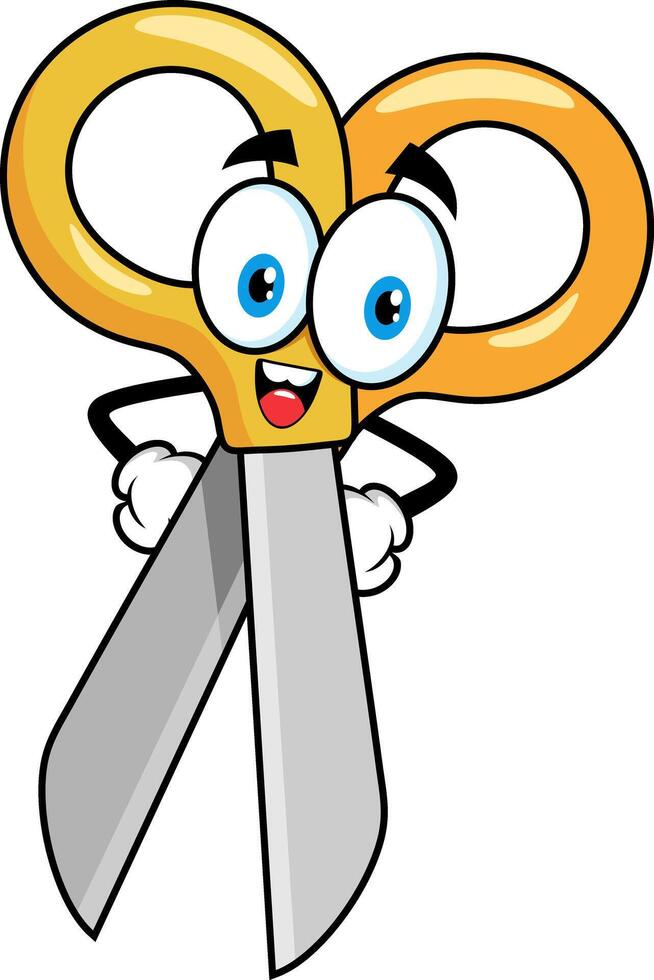

<!DOCTYPE html>
<html lang="en">
<head>
  <meta charset="utf-8" />
  <meta name="viewport" content="width=device-width,initial-scale=1" />
  <title>ViralForge Duo — Social Media & Web</title>
  <meta name="description" content="ViralForge Duo — We craft viral campaigns and build stunning websites. Book a call and let’s make your brand unforgettable." />
  <!-- Google Fonts -->
  <link href="C:\Users\Admin\Desktop" rel="stylesheet">
  
</head>
<body>
<canvas id="gold-particles"></canvas>
<!-- NAVIGATION BAR -->
<nav style="position: fixed; top: 0; left: 0; right: 0; z-index: 1000; display: flex; align-items: center; justify-content: space-between; background-color: black; padding: 10px 40px;">
  <!-- Logo Section -->
  

    
    
ViralForge Duo

  

  <!-- Navigation Links -->
  <ul style="display: flex; justify-content: center; list-style: none; margin: 0; padding: 0; gap: 25px; flex: 1; margin-right: 60px;">
    <li><a href="#home" class="nav-link active" style="color: white; text-decoration: none;">Home</a></li>
    <li><a href="#services" class="nav-link" style="color: white; text-decoration: none;">Services</a></li>
    <li><a href="#pricing" class="nav-link" style="color: white; text-decoration: none;">Pricing</a></li>
    <li><a href="#portfolio" class="nav-link" style="color: white; text-decoration: none;">Portfolio</a></li>
    <li><a href="#about" class="nav-link" style="color: white; text-decoration: none;">About</a></li>
    <li><a href="#contact" class="nav-link" style="color: white; text-decoration: none;">Contact</a></li>
  </ul>

  <!-- Theme Switcher -->
  <button id="themeSwitch" style="margin-left: 20px;">Switch Theme</button>
</nav>

<!-- HERO -->
<header id="home" class="hero">
  
  <h1>We Forge Digital Greatness — crafted for creators, built for connection.</h1>
  
We combine creative storytelling, performance marketing and pixel-perfect design to help brands get noticed, booked and remembered. If you want consistent leads, scalable campaigns and websites that convert — you’re in the right place.

  

    <button class="btn" onclick="location.href='#contact'">Book a Call</button>
    <a class="btn ghost" href="#portfolio">View Work</a>
  

</header>

  <!-- SERVICES -->
  <section id="services" class="container">
    

      <h2>Our Services</h2>
      
From single-project launches to full-service campaigns — we help brands reach real people and real results.

    

    

      

        <h3>Social Media Ads</h3>
        
Create targeted paid campaigns for Facebook, Instagram & TikTok that scale at profit.

        <ul class="features">
          <li>A/B ad creative & copy</li>
          <li>Audience research & targeting</li>
          <li>Weekly performance reports</li>
        </ul>
        
Ideal if you want consistent leads & sales from social platforms.

      

      

        <h3>Website Creation</h3>
        
Fast, responsive sites built for conversions — landing pages, portfolios, and full sites.

        <ul class="features">
          <li>SEO-friendly structure</li>
          <li>Mobile-first responsive design</li>
          <li>CMS or static builds (your choice)</li>
        </ul>
        
Perfect for brands that need a professional online presence fast.

      

      

        <h3>Website Maintenance & Support</h3>
        
Keep your site secure, updated and fast — we handle updates so you don’t have to.

        <ul class="features">
          <li>Security & uptime checks</li>
          <li>Speed optimisation</li>
          <li>Content updates & backups</li>
        </ul>
        
A great add-on for clients who want ongoing peace of mind.

      

    

 
 <h2 align="center">Our Skills</h2>

    <!-- Skills Section -->
    

      

        
HTML / CSS / JS

        

          

        

      

      

        
Responsive Design

        

          

        

      

      

        
Web Animations

        

          

        

      

      

        
Editing Skills

        

          

        

      

    

  </section>

  <!-- PRICING -->
  <section id="pricing" class="container" style="padding-top:2rem">
    

      <h2>Pricing & Packages</h2>
      
Simple, transparent pricing so you can pick the package that fits your goals.

    

    

      <!-- Starter -->
      

        <h3>Starter</h3>
        
R5,000

        
Launch a clean, high-converting presence for your business.

        <ul class="features">
          <li>Single-page or 3-page website</li>
          <li>Basic on-page SEO</li>
          <li>Social profile setup (1 platform)</li>
          <li>1 round of revisions</li>
        </ul>
        <button class="btn" onclick="book('Starter',5000)">Choose Starter</button>
      

      <!-- Growth -->
      

        <h3>Growth</h3>
        
R10,000

        
For brands ready to scale — website + social campaigns that start converting.

        <ul class="features">
          <li>5–8 page responsive website</li>
          <li>Ad campaign setup (1 platform)</li>
          <li>Monthly performance report (1 month)</li>
          <li>2 rounds of revisions</li>
        </ul>
        <button class="btn" onclick="book('Growth',10000)">Choose Growth</button>
      

      <!-- Premium -->
      

        <h3>Premium</h3>
        
R15,000

        
Full-service marketing & design for brands who want sustained growth.

        <ul class="features">
          <li>Custom website + SEO groundwork</li>
          <li>Multi-platform ad campaigns</li>
          <li>Monthly optimisation & reporting (3 months)</li>
          <li>Priority support</li>
        </ul>
        <button class="btn" onclick="book('Premium',15000)">Choose Premium</button>
      

    

  </section>

 <!-- Portfolio -->
<section id="portfolio" class="container">
  

    <h2>Portfolio</h2>
    
TO BE CONTINUED!

  

  <!-- Sub-headings with dropdowns -->
  

    

      <button class="dropdown-btn">Minigames ▼</button>
      

        <a href="#">Rock, Paper, Scissors</a>
        <a href="#">Flappy Bird</a>
      

    

    

      <button class="dropdown-btn">3D Models ▼</button>
      

        <a href="#">Add 3D Model 1</a>
        <a href="#">Add 3D Model 2</a>
      

    

    

      <button class="dropdown-btn">Buttons ▼</button>
      

        <a href="#">Button Example 1</a>
        <a href="#">Button Example 2</a>
      

    

  

</section>

  <!-- ABOUT -->
  <section id="about" class="container">
    

      <h2>About ViralForge Duo</h2>
      
We’re Rikus & team — a tight-knit creative studio focused on growth, aesthetics and measurable impact.

    

    

      We turn ideas into attention: strategy-first thinking, eye-catching creative and marketing that turns viewers into customers. Our approach is tailored, transparent and focused on your business goals — not vanity metrics.
    

  </section>

  <!-- CONTACT -->
<section id="contact" class="container">
  

    <h2>Contact & Bookings</h2>
    
Ready to start? Book a call, send a message, or hit us on WhatsApp for a quick quote.

  

  

    <form id="contactForm" action="mailto:ViralForgeDuo@gmail.com" method="post" enctype="text/plain">
      <input id="name" name="name" type="text" placeholder="Your name" required>
      <input id="email" name="email" type="email" placeholder="Email address" required>
      <textarea id="message" name="message" rows="5" placeholder="Tell us about your project" required></textarea>

      

        <button class="btn" type="submit">Send Message</button>
        <a class="btn ghost" href="https://wa.me/27660542468" target="_blank" rel="noopener">Chat on WhatsApp</a>
      

      

    </form>
  

</section>

<footer>
  
&copy;  ViralForge Duo — All rights reserved.

</footer>

<!-- Robot Assistant -->

🤖

Hi, I'm your digital assistant!

<!-- Minigames Modal -->

  

    <button id="closeMinigame">X</button>
    

  

</body>
</html>
